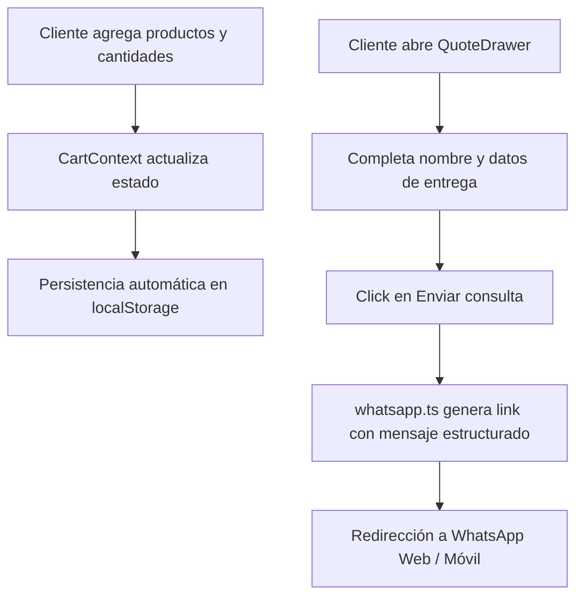

# Arquitectura de la Aplicación

Este documento detalla el diseño técnico, la estructura de carpetas y los flujos lógicos clave del e-commerce B2B.

## Estructura de Directorios

La base del código sigue la arquitectura recomendada por Next.js App Router:

*   **`src/app/`**: Contiene las rutas, layouts globales y páginas del e-commerce:
    *   `page.tsx`: Página de inicio (Hero, Quiénes Somos, Acordeón de FAQs).
    *   `catalogo/page.tsx`: Catálogo mayorista para armar consultas.
    *   `materia-prima/page.tsx`: Galería y carrusel de materias primas/materiales.
*   **`src/components/`**: Componentes reutilizables divididos por alcance:
    *   `layout/`: Componentes comunes del marco (Header con Scroll Spy, Footer unificado).
    *   `catalog/`: Componentes específicos del flujo de catálogo (tarjetas de productos `ProductCard`, grilla de filtros `ProductGrid`, panel lateral de cotización `QuoteDrawer`).
*   **`src/context/`**: `CartContext.tsx` provee el estado global de la lista virtual (carrito) y persistencia automática en `localStorage`.
*   **`src/data/`**: Contiene la base de datos local en formato JSON:
    *   `products.json`: Listado de los 15 cinturones del catálogo.
    *   `materials.json`: Listado de materias primas y carrusel interactivo.
    *   `mockProducts.ts`: Provee interfaces de tipado TypeScript y realiza el mapeo seguro de datos.
*   **`src/lib/`**: Utilidades puras (como `whatsapp.ts` para construir el mensaje estructurado de pedido de WhatsApp).

## Flujo de Despacho del Pedido

El proceso de compra offline-online sigue este flujo de responsabilidad única:

## Estrategia de Testing

El proyecto cuenta con cobertura de pruebas unitarias y de integración utilizando **Vitest** con el entorno de simulación de navegador **jsdom**:

*   **Archivos de Pruebas**: Ubicados junto a los componentes que testean (ej. `ProductCard.test.tsx`, `Header.test.tsx`, `MateriaPrima.test.tsx`).
*   **Aislamiento**: Se mockean librerías dinámicas como `next/navigation` mediante `vi.mock()` para asegurar que las pruebas de los componentes de Next.js corran de manera aislada e independiente en terminal.
